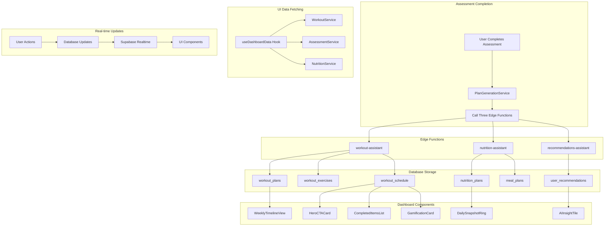

# Assessment Data Flow Analysis: From Edge Functions to UI Visualization

## 🔄 Complete Data Flow Overview

### 1. Assessment Completion Process
```
User Completes Assessment → PlanGenerationService → Three Edge Functions → Database Storage → UI Visualization
```

## 📊 Edge Function Data Outputs

### 🏋️ Workout Assistant (`workout-assistant`)
**Returns:** `{ success: true, data: { workout_plans: number, workout_schedule: [...] } }`

**Database Storage:**
- `workout_plans` table: Workout templates with metadata
- `workout_exercises` table: Individual exercises for each workout
- `workout_schedule` table: Scheduled workouts for specific dates

**Data Structure:**
```json
{
  "workout_schedule": [
    {
      "week": 1,
      "day": "Monday",
      "workout_title": "Upper Body Strength",
      "description": "Focus on chest, back, and arms",
      "category": "strength",
      "difficulty": 3,
      "estimated_duration": "45 minutes",
      "exercises": [
        {
          "name": "Push-ups",
          "sets": 3,
          "reps": "10-15",
          "weight": "bodyweight",
          "rest_seconds": 60,
          "notes": "Keep proper form"
        }
      ]
    }
  ]
}
```

### 🍽️ Nutrition Assistant (`nutrition-assistant`)
**Returns:** `{ success: true, data: { nutrition_plan: string, nutrition_data: {...} } }`

**Database Storage:**
- `nutrition_plans` table: Daily calorie and macro targets
- `meal_plans` table: Individual meal suggestions

**Data Structure:**
```json
{
  "nutrition_plan": {
    "daily_calories": 2100,
    "protein_g": 140,
    "carbs_g": 210,
    "fat_g": 70,
    "diet_type": "standard",
    "meals": [
      {
        "meal_type": "breakfast",
        "meal_title": "Protein Smoothie Bowl",
        "calories": 450,
        "protein_g": 25,
        "carbs_g": 45,
        "fat_g": 15
      }
    ]
  }
}
```

### 💡 Recommendations Assistant (`recommendations-assistant`)
**Returns:** `{ success: true, data: { recommendations: string, recommendations_data: {...} } }`

**Database Storage:**
- `user_recommendations` table: AI-generated coaching tips

**Data Structure:**
```json
{
  "workout_tips": "Focus on compound movements like squats and push-ups...",
  "nutrition_tips": "Prioritize protein in your meals to fuel muscle growth...",
  "weekly_goals": "Complete 3 strength training workouts this week..."
}
```

## 🎯 UI Visualization Mapping

### 📱 Dashboard Components & Data Sources

#### 1. **HeroCTACard** (Primary Workout Display)
**Data Source:** `workout_schedule` table (filtered by current date)
**Visualization:** Today's scheduled workout with start button
**Key Fields:**
- `workout.title` → Display workout name
- `workout.exercises.length` → Show exercise count
- `workout.estimatedDuration` → Show duration
- `workout.isCompleted` → Determine if workout is done

#### 2. **DailySnapshotRing** (Nutrition Progress)
**Data Source:** `nutrition_plans` + `nutrition_logs` tables
**Visualization:** Circular progress rings for calories and protein
**Key Fields:**
- `nutrition_plans.daily_calories` → Target calories
- `nutrition_logs.total_calories` → Consumed calories
- `nutrition_plans.protein_g` → Target protein
- `nutrition_logs.total_protein_g` → Consumed protein

#### 3. **AIInsightTile** (Coach Insights)
**Data Source:** `user_recommendations` table
**Visualization:** AI-generated coaching tips and advice
**Key Fields:**
- `user_recommendations.workout_tips` → Workout advice
- `user_recommendations.nutrition_tips` → Nutrition advice
- `user_recommendations.weekly_goals` → Weekly targets

#### 4. **WeightProgressCard** (Progress Tracking)
**Data Source:** `progress_metrics` table
**Visualization:** Weight trend chart with nutrition context
**Key Fields:**
- `progress_metrics.weight` → Current weight
- `progress_metrics.measurement_date` → Date tracking
- `nutrition_plans` → Context for weight changes

#### 5. **WeeklyTimelineView** (Weekly Overview)
**Data Source:** `workout_schedule` + `nutrition_logs` tables
**Visualization:** Weekly calendar with workout and meal indicators
**Key Fields:**
- `workout_schedule.scheduled_date` → Workout dates
- `workout_schedule.is_completed` → Completion status
- `nutrition_logs.log_date` → Meal logging dates

#### 6. **CompletedItemsList** (Today's Activities)
**Data Source:** `workout_logs` + `meal_logs` tables
**Visualization:** List of completed workouts and meals
**Key Fields:**
- `workout_logs.start_time` → Workout completion time
- `meal_logs.consumed_at` → Meal logging time
- `workout_logs.workout_plan_id` → Link to workout details

#### 7. **GamificationCard** (Achievements & Streaks)
**Data Source:** `workout_logs` + `nutrition_logs` tables
**Visualization:** Streak counters and achievement badges
**Key Fields:**
- `workout_logs.created_at` → Calculate workout streaks
- `nutrition_logs.log_date` → Calculate meal logging streaks

## 🔄 Data Flow Diagram



## 📈 Data Visualization Summary

### ✅ **Currently Visualized Data:**
1. **Workout Schedule** → HeroCTACard, WeeklyTimelineView
2. **Nutrition Targets** → DailySnapshotRing (hardcoded values)
3. **AI Recommendations** → AIInsightTile (hardcoded content)
4. **Progress Metrics** → WeightProgressCard (mock data)
5. **Completed Activities** → CompletedItemsList (mock data)

### ❌ **Missing Visualizations:**
1. **Nutrition Plan Data** → Not properly connected to DailySnapshotRing
2. **Recommendations Data** → Not connected to AIInsightTile
3. **Real Progress Data** → WeightProgressCard uses mock data
4. **Actual Completed Items** → CompletedItemsList uses mock data

## 🎯 Key Findings

### **Data Generation vs. Visualization Gap:**
- ✅ **Edge functions generate rich data** and store it in database
- ❌ **UI components use hardcoded/mock data** instead of real database data
- 🔄 **Data flow is complete** but visualization is disconnected

### **Immediate Improvements Needed:**
1. **Connect nutrition_plans to DailySnapshotRing**
2. **Connect user_recommendations to AIInsightTile**
3. **Replace mock data with real database queries**
4. **Add real-time updates for user actions**

### **Data Flow Status:**
- **Assessment → Edge Functions → Database**: ✅ Working
- **Database → UI Components**: ❌ Partially broken
- **Real-time Updates**: ❌ Not implemented
- **User Actions → Database**: ✅ Working

## 🚀 Next Steps for Full Integration

1. **Update useDashboardData hook** to fetch nutrition and recommendations data
2. **Modify UI components** to use real data instead of mock data
3. **Add real-time subscriptions** for live updates
4. **Implement proper error handling** for missing data
5. **Add loading states** for data fetching
